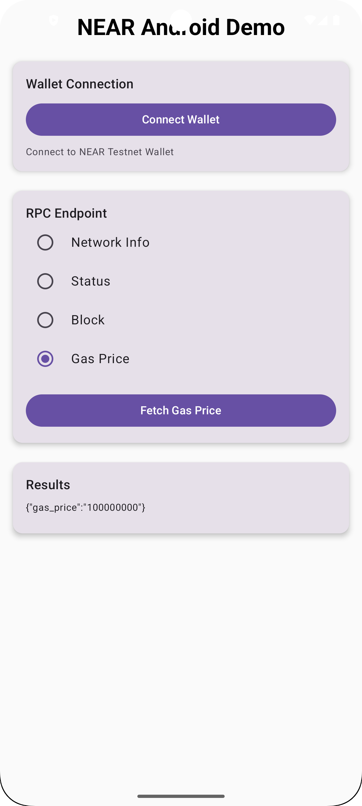
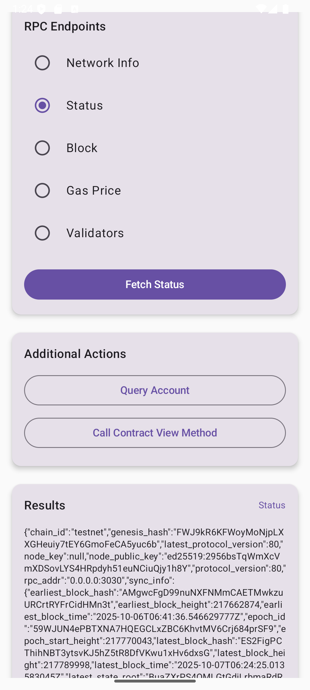

# NEAR Android Demo App

A modern, production-ready Android application showcasing NEAR blockchain integration with clean architecture, proper state management, and comprehensive error handling.

## 🚀 Features

### Core Features
- ✅ **Wallet Connection** - Seamless NEAR Testnet/Mainnet wallet integration via Custom Tabs
- ✅ **Network Monitoring** - Real-time NEAR network status and information
- ✅ **RPC Integration** - Direct access to 15+ NEAR JSON-RPC endpoints
- ✅ **Modern UI** - Built with Jetpack Compose and Material 3
- ✅ **Type Safety** - Full Kotlin type safety with generated models
- ✅ **Proper Architecture** - MVVM with Repository pattern
- ✅ **State Management** - StateFlow for reactive UI updates
- ✅ **Error Handling** - Comprehensive error handling with sealed classes
- ✅ **Contract Interaction** - View method calls with custom parameters
- ✅ **Account Queries** - Query any NEAR account information

### New Update
- 🎯 **ViewModel Architecture** - Proper state management with Jetpack ViewModel
- 🔄 **StateFlow Integration** - Reactive UI updates
- 🛡️ **Comprehensive Error Handling** - Sealed class error types
- 📡 **15+ RPC Endpoints** - Expanded endpoint coverage
- 🔍 **Advanced Queries** - Account queries and contract view calls
- 🧪 **Unit Tests** - ViewModel and Repository testing
- 📦 **Updated Library** - Using near-jsonrpc-kotlin-client v1.1.3

## 📸 Screenshots




## 🏗️ Architecture

```
┌─────────────────────────────────────────┐
│          UI Layer (Compose)             │
│  - MainScreen.kt                        │
│  - Dialogs & Components                 │
└───────────────┬─────────────────────────┘
                │
┌───────────────▼─────────────────────────┐
│         ViewModel Layer                 │
│  - NearViewModel.kt                     │
│  - State Management (StateFlow)         │
└───────────────┬─────────────────────────┘
                │
┌───────────────▼─────────────────────────┐
│        Repository Layer                 │
│  - NearRepository.kt                    │
│  - RPC Client Wrapper                   │
│  - Error Handling                       │
└───────────────┬─────────────────────────┘
                │
┌───────────────▼─────────────────────────┐
│      NEAR JSON-RPC Client Library       │
│  - JsonRpcTransport                     │
│  - NearRpcClient                        │
│  - Type Models                          │
└─────────────────────────────────────────┘
```

## 🛠️ Tech Stack

- **Language**: Kotlin
- **UI Framework**: Jetpack Compose
- **Architecture**: MVVM + Repository Pattern
- **State Management**: StateFlow
- **HTTP Client**: Ktor with OkHttp engine
- **Serialization**: kotlinx.serialization
- **NEAR Integration**: near-jsonrpc-kotlin-client v1.1.3
- **Testing**: JUnit, kotlinx-coroutines-test

## 📦 Dependencies

### Core Dependencies

```kotlin
// NEAR JSON-RPC Kotlin Client v1.1.3
implementation("com.github.Psianturi.near-jsonrpc-kotlin-client:near-jsonrpc-client:v1.1.3")

// Ktor HTTP Client
implementation("io.ktor:ktor-client-okhttp:2.3.12")
implementation("io.ktor:ktor-client-content-negotiation:2.3.12")
implementation("io.ktor:ktor-serialization-kotlinx-json:2.3.12")

// Kotlinx Serialization
implementation("org.jetbrains.kotlinx:kotlinx-serialization-json:1.6.3")

// Custom Tabs for Wallet
implementation("androidx.browser:browser:1.8.0")

// Lifecycle & ViewModel
implementation("androidx.lifecycle:lifecycle-viewmodel-compose:2.8.3")
implementation("androidx.lifecycle:lifecycle-runtime-ktx:2.8.3")
```

### Repository Setup

```kotlin
// settings.gradle.kts
dependencyResolutionManagement {
    repositories {
        mavenCentral()
        maven { url = uri("https://jitpack.io") }
    }
}
```

## 🔧 Setup Instructions

### Prerequisites
- Android Studio Hedgehog or later
- JDK 17 or later
- Android device/emulator (API 24+)
- NEAR Testnet account (for wallet testing)

### Quick Start

1. **Clone Repository**
   ```bash
   git clone https://github.com/Psianturi/near-kotlin
   cd nearkotlin
   ```

2. **Open in Android Studio**
   - Import project
   - Wait for Gradle sync to complete

3. **Build and Run**
   ```bash
   ./gradlew assembleDebug
   ./gradlew installDebug
   ```

4. **Grant Permissions**
   - Allow internet access when prompted
   - The app will request necessary permissions automatically

## 🌐 Network Configuration

For Android API 28+, cleartext traffic is configured in `network_security_config.xml`:

```xml
<domain-config cleartextTrafficPermitted="true">
    <domain includeSubdomains="true">rpc.testnet.near.org</domain>
    <domain includeSubdomains="true">rpc.mainnet.near.org</domain>
    <domain includeSubdomains="true">wallet.testnet.near.org</domain>
    <domain includeSubdomains="true">wallet.mainnet.near.org</domain>
</domain-config>
```

## 📚 API Features

### Available RPC Endpoints

| Endpoint | Description | Status |
|----------|-------------|--------|
| **network_info** | Network connection status & peers | ✅ Ready |
| **status** | Node status, sync info, validators | ✅ Ready |
| **block** | Block details (height, hash, timestamp) | ✅ Ready |
| **gas_price** | Current gas prices | ✅ Ready |
| **validators** | Active validators list | ✅ Ready |
| **health** | RPC node health status | ✅ Ready |
| **protocol_config** | Protocol-level parameters | ✅ Ready |
| **genesis_config** | Genesis block configuration | ✅ Ready |
| **chunk** | Chunk details by hash | ✅ Ready |
| **changes** | State changes in block | ✅ Ready |
| **query** | Generic account/contract queries | ✅ Ready |
| **tx_status** | Transaction status by hash | ✅ Ready |
| **client_config** | Client node configuration | ✅ Ready |
| **light_client_proof** | Light client proofs | ✅ Ready |

### Advanced Features

#### 1. Account Queries
Query any NEAR account information:

```kotlin
viewModel.queryAccount("example.testnet")
```

Returns account balance, storage usage, code hash, etc.

#### 2. Contract View Calls
Call smart contract view methods:

```kotlin
viewModel.callViewMethod(
    contractId = "contract.testnet",
    methodName = "get_message",
    args = "{}"
)
```

#### 3. Transaction Status
Check transaction execution status:

```kotlin
viewModel.getTransactionStatus(
    txHash = "transaction_hash_here",
    accountId = "sender.testnet"
)
```

## 🧪 Testing

### Unit Tests

```bash
# Run all unit tests
./gradlew testDebugUnitTest

# Run specific test class
./gradlew test --tests "NearViewModelTest"
```

### Integration Tests

```bash
./gradlew connectedDebugAndroidTest
```

### Manual Testing Checklist

- [ ] **Wallet Connection**
  - Tap "Connect Wallet"
  - Verify Custom Tabs opens NEAR wallet
  - Complete authentication
  - Check callback handling

- [ ] **RPC Endpoints**
  - Test each endpoint individually
  - Verify data fetching works
  - Check error handling for network issues

- [ ] **Account Queries**
  - Query connected wallet account
  - Query other accounts
  - Verify balance display

- [ ] **Contract Calls**
  - Call view methods
  - Test with different parameters
  - Verify result parsing

## 💡 Usage Examples

### Basic Setup

```kotlin
// ViewModel is automatically created by MainActivity
class MainActivity : ComponentActivity() {
    private val viewModel: NearViewModel by viewModels()
    
    override fun onCreate(savedInstanceState: Bundle?) {
        super.onCreate(savedInstanceState)
        setContent {
            MaterialTheme {
                MainScreen(
                    viewModel = viewModel,
                    initialAccountId = getAccountFromDeepLink()
                )
            }
        }
    }
}
```

### Observing State in Compose

```kotlin
@Composable
fun MyScreen(viewModel: NearViewModel) {
    val uiState by viewModel.uiState.collectAsStateWithLifecycle()
    val walletState by viewModel.walletState.collectAsStateWithLifecycle()
    val rpcResult by viewModel.rpcResult.collectAsStateWithLifecycle()
    
    when {
        uiState.isLoading -> LoadingView()
        uiState.error != null -> ErrorView(uiState.error)
        rpcResult is NearResult.Success -> SuccessView(rpcResult.data)
    }
}
```

### Making RPC Calls

```kotlin
// Fetch endpoint data
viewModel.fetchEndpointData(RpcEndpoint.Status)

// Query account
viewModel.queryAccount("example.testnet")

// Call contract method
viewModel.callViewMethod(
    contractId = "guest-book.testnet",
    methodName = "get_messages",
    args = """{"from_index": "0", "limit": "10"}"""
)
```

### Error Handling

```kotlin
when (val error = uiState.error) {
    is NearError.NetworkError -> {
        // Handle network issues
        Text("Network error: ${error.message}")
    }
    is NearError.RpcError -> {
        // Handle RPC errors
        Text("RPC error (${error.code}): ${error.message}")
    }
    is NearError.AuthError -> {
        // Handle authentication errors
        Text("Auth error: ${error.message}")
    }
    else -> {
        // Handle other errors
        Text("Error: ${error?.toDisplayMessage()}")
    }
}
```

## 🔐 Wallet Integration

### Connection Flow

1. User taps "Connect Wallet"
2. App opens NEAR Wallet in Custom Tab
3. User authenticates in wallet
4. Wallet redirects to `myapp://callback`
5. App receives account ID and public key
6. App updates wallet state and queries account info

### Deep Link Configuration

```xml
<!-- AndroidManifest.xml -->
<intent-filter android:autoVerify="true">
    <action android:name="android.intent.action.VIEW" />
    <category android:name="android.intent.category.DEFAULT" />
    <category android:name="android.intent.category.BROWSABLE" />
    <data android:scheme="myapp" android:host="callback" />
</intent-filter>
```

## 📊 State Management

### UI States

```kotlin
data class NearUiState(
    val isLoading: Boolean = false,
    val error: NearError? = null,
    val lastEndpoint: String? = null,
    val selectedEndpoint: RpcEndpoint = RpcEndpoint.NetworkInfo
)
```

### Wallet States

```kotlin
data class WalletState(
    val isConnected: Boolean = false,
    val accountId: String? = null,
    val balance: String? = null
)
```

### Result States

```kotlin
sealed class NearResult<out T> {
    data class Success<T>(val data: T) : NearResult<T>()
    data class Error(val error: NearError) : NearResult<Nothing>()
    data object Loading : NearResult<Nothing>()
}
```

## 🐛 Troubleshooting

See [TROUBLESHOOTING.md](TROUBLESHOOTING.md) for common issues and solutions.

## 🧪 Testing Guide

See [TESTING.md](TESTING.md) for detailed testing instructions.

## 📄 License

This project is licensed under the Apache License 2.0 - see the LICENSE file for details.

## 🙏 Acknowledgments

- **NEAR Protocol** - For the blockchain infrastructure
- **near-jsonrpc-kotlin-client** - For the RPC client library
- **Jetpack Compose** - For modern Android UI
- **Ktor** - For HTTP client functionality
- **kotlinx.serialization** - For data serialization

## 📞 Support

- **Issues**: [GitHub Issues](https://github.com/Psianturi/near-kotlin/issues)
- **Discussions**: [GitHub Discussions](https://github.com/Psianturi/near-kotlin/discussions)
- **NEAR Docs**: [docs.near.org](https://docs.near.org)

## 🔗 Related Projects

- [near-jsonrpc-kotlin-client](https://github.com/Psianturi/near-jsonrpc-kotlin-client) - The underlying RPC client library
- [NEAR Protocol](https://github.com/near/nearcore) - NEAR Protocol core implementation
- [NEAR Wallet](https://wallet.near.org) - Official NEAR Wallet

---

**Happy coding with NEAR! 🚀✨**